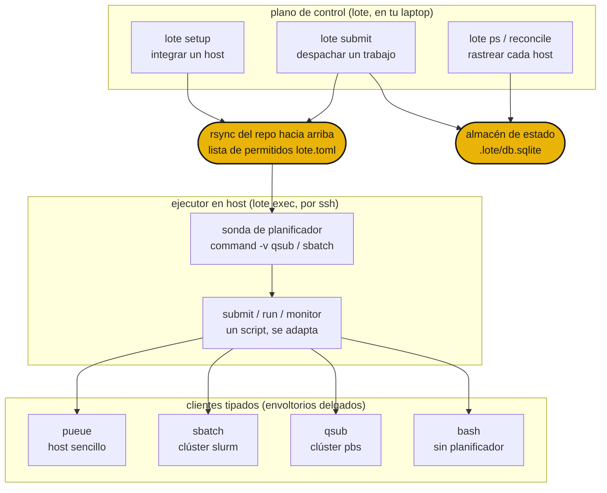

# Cómo funciona

`lote submit <host> <script>` hace rsync de tu repo al host, abre una conexión ssh y entrega el script al planificador de ese host a través del ejecutor en host. El mismo script aterriza en una caja sencilla, un clúster slurm o una supercomputadora pbs sin cambios de código, porque lote elige el backend a partir de lo que el host realmente tiene.



## Las tres capas

**Plano de control** (`lote`) corre en tu laptop. Integra hosts con `lote setup`, despacha trabajos con `lote submit` y rastrea el estado de las ejecuciones en cada host con `lote ps` y `lote reconcile`. Nunca ejecuta un trabajo por sí mismo. Maneja el ejecutor en host por ssh y registra cada despacho en un almacén de estado local.

**Ejecutor en host** (`lote exec`) corre en un host. Encuentra el script del trabajo, detecta el planificador que el host realmente tiene, luego envía, ejecuta y monitorea el trabajo, adaptándose automáticamente a ese planificador. También puedes ejecutarlo a mano en un nodo de inicio de sesión, pero lote normalmente lo invoca por ti como `chefe run lote exec ...`.

**Clientes tipados** son envoltorios delgados sobre las herramientas reales (`qsub`, `sbatch`, `pueue`, `rsync`). Cada uno parsea la salida de esa herramienta en registros tipados, así que el ejecutor lee el estado de un trabajo de la misma forma en todas partes. Los nuevos backends son nuevas clases, nunca nuevas ramas `if host == ...`.

## Detección automática del planificador

lote integra un host una vez con `lote setup`, sondeándolo en una shell de inicio de sesión para que la cadena de herramientas del clúster esté en PATH. A partir de lo que encuentra, enruta cada trabajo posterior para ese host.

| host | qué encuentra lote | backend |
|---|---|---|
| un DGX o PC por ssh | sin planificador | `pueue` |
| un clúster slurm (p. ej. miyabi) | `sbatch` | `sbatch` |
| un clúster pbs (p. ej. Pegasus) | `qsub` | `qsub` |
| un nodo de inicio de sesión sencillo | nada planificable | `bash` |

El mismo `job.sh` corre en los cuatro. Los scripts de trabajo protegen `module load` con `command -v module`, así que no hacen nada fuera de un clúster, y los argumentos posicionales fluyen a través de una variable de entorno `ARGS` que el script reenvía a su punto de entrada.

La integración también mapea las clases de nodo del host. El nodo de login se sondea por ssh, luego cada cola del planificador (de `qstat -q` o `sinfo`) recibe un trabajo de sondeo mínimo que reporta la GPU, la memoria y los núcleos reales de sus nodos, en caché por clase. Mira la [referencia de configuración](configuration.md) para ver cómo se guardan las clases.

## Flujo de despacho

```sh
lote setup miyabi              # probe + rsync + chefe install, then cache the host's facts
lote submit miyabi train.sh    # rsync up, pick sbatch, submit, print + record the handle
lote ps                        # the run shows up across every host
lote reconcile miyabi          # compare recorded runs with the live scheduler
lote pull <handle>             # rsync the recorded results path back
```

Un host se convierte en destino solo después de que `chefe install` tiene éxito durante la integración, así que una máquina que no puede construir el entorno nunca se convierte en destino. Después de eso, cada despacho es rsync hacia arriba, una llamada ssh a `lote exec` y una fila escrita en el almacén de estado.

A continuación, la [referencia de comandos](commands.md) y la [referencia de configuración](configuration.md).
