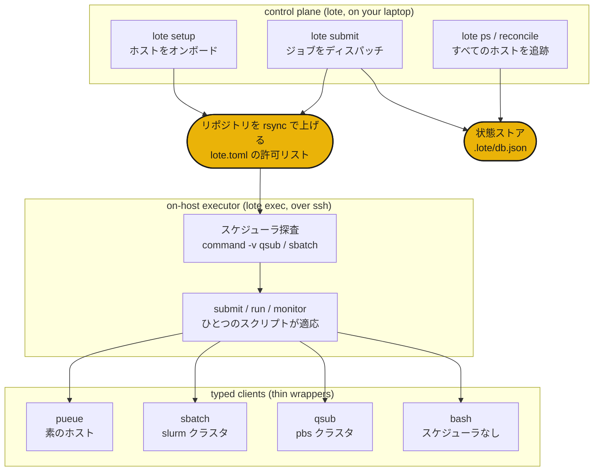

# How it works

`lote submit <host> <script>` はリポジトリをホストへ rsync し、ひとつの ssh 接続を開き、オンホストエグゼキュータを通じてスクリプトをそのホストのスケジューラに渡します。lote はホストが実際に持っているものからバックエンドを選ぶため、同じスクリプトがコードの変更なしに素のマシン、slurm クラスタ、pbs スーパーコンピュータのいずれにも届きます。



## 3 つの層

**コントロールプレーン**（`lote`）はあなたのノートパソコンで動きます。`lote setup` でホストをオンボードし、`lote submit` でジョブをディスパッチし、`lote ps` と `lote reconcile` ですべてのホストの実行状態を追跡します。それ自身がジョブを実行することは決してありません。ssh 越しにオンホストエグゼキュータを駆動し、すべてのディスパッチをローカルの状態ストアに記録します。

**オンホストエグゼキュータ**（`lote exec`）はひとつのホストで動きます。ジョブスクリプトを見つけ、そのホストが実際に持つスケジューラを検出し、ジョブを submit、run、monitor して、そのスケジューラに自動的に適応します。ログインノードで手動で実行することもできますが、通常は lote が `chefe run lote exec ...` としてあなたの代わりに呼び出します。

**型付きクライアント**は、実際のツール（`qsub`、`sbatch`、`pueue`、`rsync`）に対する薄いラッパーです。それぞれがそのツールの出力を型付きレコードへパースするため、エグゼキュータはどこでも同じやり方でジョブの状態を読み取れます。新しいバックエンドは新しいクラスであり、決して新しい `if host == ...` の分岐ではありません。

## スケジューラの自動検出

lote は `lote setup` でホストを一度オンボードし、ログインシェルで探査することでクラスタのツールチェーンを PATH に乗せます。見つけたものから、そのホストへの以降のすべてのジョブをルーティングします。

| ホスト | lote が見つけるもの | バックエンド |
|---|---|---|
| ssh 越しの DGX や PC | スケジューラなし | `pueue` |
| slurm クラスタ（例: miyabi） | `sbatch` | `sbatch` |
| pbs クラスタ（例: Pegasus） | `qsub` | `qsub` |
| 素のログインノード | スケジューラに乗せられるものなし | `bash` |

同じ `job.sh` が 4 つすべてで動きます。ジョブスクリプトは `module load` を `command -v module` でガードするため、クラスタ外では何もしません。また、位置引数はスクリプトがそのエントリポイントへ転送する `ARGS` 環境変数を通って流れます。

## ディスパッチフロー

```sh
lote setup miyabi              # probe + rsync + chefe install, then cache the host's facts
lote submit miyabi train.sh    # rsync up, pick sbatch, submit, print + record the handle
lote ps                        # the run shows up across every host
lote reconcile miyabi          # compare recorded runs with the live scheduler
lote pull <handle>             # rsync the recorded results path back
```

ホストはオンボード中に `chefe install` が成功して初めてターゲットになるため、環境をビルドできないマシンは決してターゲットになりません。その後、各ディスパッチは rsync で上げ、`lote exec` へのひとつの ssh 呼び出し、そして状態ストアへの 1 行の書き込みです。

次は、[コマンドリファレンス](commands.md)と[設定リファレンス](configuration.md)です。
