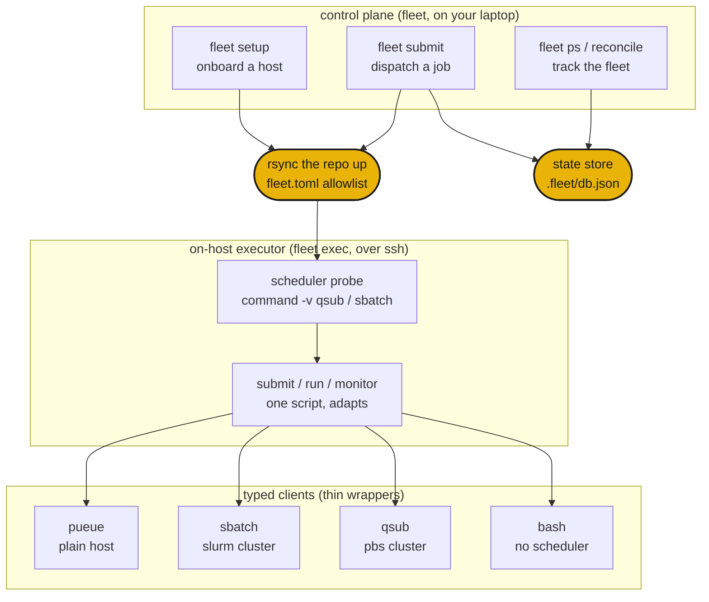

# How it works

`fleet submit <host> <script>` rsyncs your repo to the host, opens one ssh connection, and hands the script to that host's scheduler through the on-host executor. The same script lands on a plain box, a slurm cluster, or a pbs supercomputer with no code changes, because fleet picks the backend from what the host actually has.



## The three layers

**Control plane** (`fleet`) runs on your laptop. It onboards hosts with `fleet setup`, dispatches jobs with `fleet submit`, and tracks run state across the whole fleet with `fleet ps` and `fleet reconcile`. It never runs a job itself. It drives the on-host executor over ssh and records every dispatch to a local state store.

**On-host executor** (`fleet exec`) runs on one host. It finds the job script, detects the scheduler the host actually has, then submits, runs, and monitors the job, auto-adapting to that scheduler. You can also run it by hand on a login node, but fleet usually invokes it for you as `chefe run fleet exec ...`.

**Typed clients** are thin wrappers over the real tools (`qsub`, `sbatch`, `pueue`, `rsync`). Each parses that tool's output into typed records, so the executor reads a job's state the same way everywhere. New backends are new classes, never new `if host == ...` branches.

## Scheduler auto-detection

fleet onboards a host once with `fleet setup`, probing it in a login shell so the cluster toolchain is on PATH. From what it finds, it routes every later job for that host.

| host | what fleet finds | backend |
|---|---|---|
| a DGX or PC over ssh | no scheduler | `pueue` |
| a slurm cluster (e.g. miyabi) | `sbatch` | `sbatch` |
| a pbs cluster (e.g. Pegasus) | `qsub` | `qsub` |
| a plain login node | nothing schedulable | `bash` |

The same `job.sh` runs in all four. Job scripts guard `module load` with `command -v module`, so they no-op off a cluster, and positional arguments flow through an `ARGS` env var the script forwards to its entry point.

## Dispatch flow

```sh
fleet setup miyabi              # probe + rsync + chefe install, then cache the host's facts
fleet submit miyabi train.sh    # rsync up, pick sbatch, submit, print + record the handle
fleet ps                        # the run shows up across the fleet
fleet reconcile miyabi          # compare recorded runs with the live scheduler
fleet pull <handle>             # rsync the recorded results path back
```

A host enters the fleet only after `chefe install` succeeds during onboarding, so a machine that cannot build the environment never becomes a target. After that, each dispatch is rsync up, one ssh call into `fleet exec`, and one row written to the state store.

Next, the [command reference](commands.md) and the [configuration reference](configuration.md).
