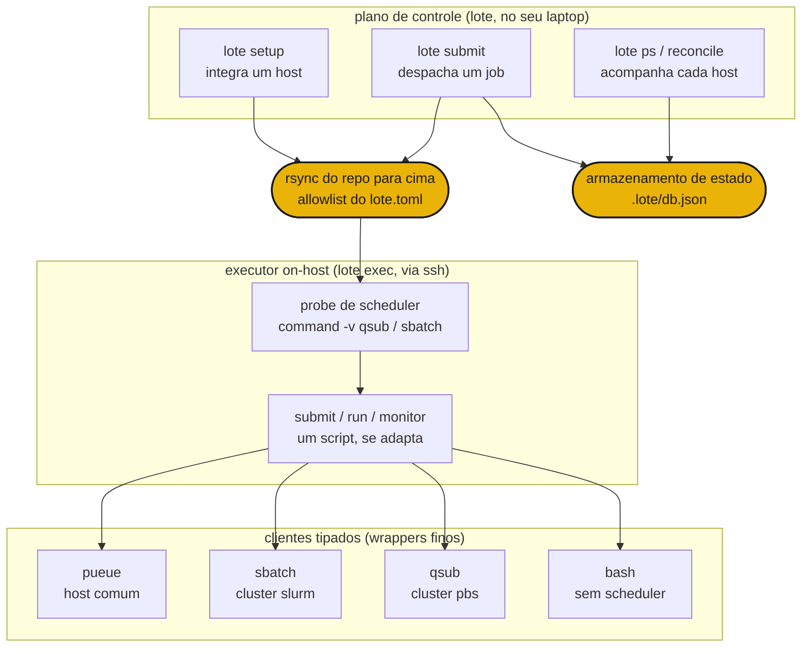

# Como funciona

`lote submit <host> <script>` faz rsync do seu repositório até o host, abre uma única conexão ssh e entrega o script ao scheduler daquele host por meio do executor on-host. O mesmo script chega a uma máquina comum, a um cluster slurm ou a um supercomputador pbs sem mudanças de código, porque o lote escolhe o backend a partir do que o host realmente tem.



## As três camadas

**Plano de controle** (`lote`) roda no seu laptop. Ele integra hosts com `lote setup`, despacha jobs com `lote submit` e acompanha o estado das execuções em cada host com `lote ps` e `lote reconcile`. Ele nunca roda um job por conta própria. Ele dirige o executor on-host via ssh e registra cada dispatch em um armazenamento de estado local.

**Executor on-host** (`lote exec`) roda em um único host. Ele encontra o script do job, detecta o scheduler que o host de fato tem e então submete, roda e monitora o job, adaptando-se automaticamente àquele scheduler. Você também pode rodá-lo à mão em um login node, mas o lote normalmente o invoca por você como `chefe run lote exec ...`.

**Clientes tipados** são wrappers finos sobre as ferramentas reais (`qsub`, `sbatch`, `pueue`, `rsync`). Cada um analisa a saída daquela ferramenta em registros tipados, de modo que o executor lê o estado de um job da mesma maneira em todo lugar. Novos backends são novas classes, nunca novos ramos `if host == ...`.

## Auto-detecção de scheduler

O lote integra um host uma única vez com `lote setup`, sondando-o em um login shell para que a toolchain do cluster esteja no PATH. A partir do que ele encontra, roteia todo job posterior para aquele host.

| host | o que o lote encontra | backend |
|---|---|---|
| um DGX ou PC via ssh | nenhum scheduler | `pueue` |
| um cluster slurm (ex.: miyabi) | `sbatch` | `sbatch` |
| um cluster pbs (ex.: Pegasus) | `qsub` | `qsub` |
| um login node comum | nada agendável | `bash` |

O mesmo `job.sh` roda nos quatro. Scripts de job protegem o `module load` com `command -v module`, então eles não fazem nada fora de um cluster, e argumentos posicionais fluem por uma variável de ambiente `ARGS` que o script encaminha ao seu entry point.

## Fluxo de dispatch

```sh
lote setup miyabi              # probe + rsync + chefe install, then cache the host's facts
lote submit miyabi train.sh    # rsync up, pick sbatch, submit, print + record the handle
lote ps                        # the run shows up across every host
lote reconcile miyabi          # compare recorded runs with the live scheduler
lote pull <handle>             # rsync the recorded results path back
```

Um host só se torna um alvo depois que o `chefe install` tem sucesso durante a integração, então uma máquina que não consegue construir o ambiente nunca se torna um alvo. Depois disso, cada dispatch é rsync para cima, uma única chamada ssh para o `lote exec` e uma única linha gravada no armazenamento de estado.

A seguir, a [referência de comandos](commands.md) e a [referência de configuração](configuration.md).
