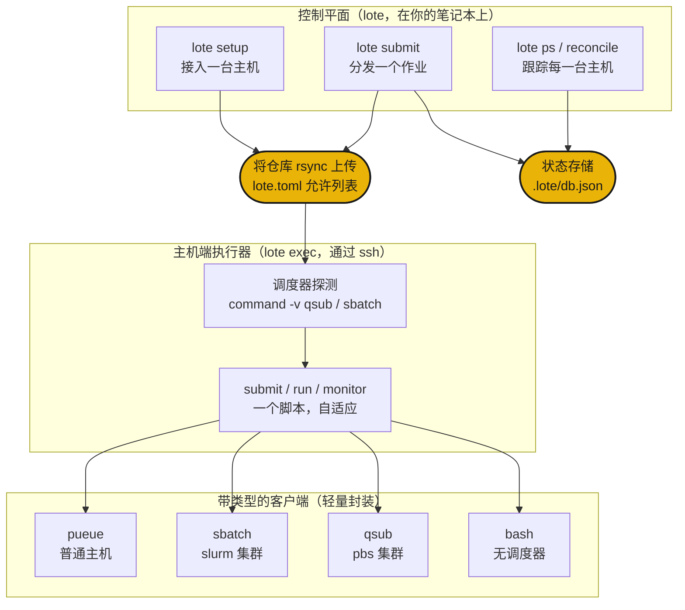

# 工作原理

`lote submit <host> <script>` 将你的仓库 rsync 到主机上，打开一条 ssh 连接，并通过主机端执行器把脚本交给那台主机的调度器。同一个脚本无需任何代码改动，就能落地到一台普通机器、一个 slurm 集群或一台 pbs 超级计算机上，因为 lote 会根据主机实际拥有的东西来挑选后端。



## 三个层次

**控制平面**（`lote`）运行在你的笔记本上。它用 `lote setup` 接入主机，用 `lote submit` 分发作业，并用 `lote ps` 和 `lote reconcile` 跨每一台主机跟踪运行状态。它从不自己运行作业。它通过 ssh 驱动主机端执行器，并把每一次分发记录到本地状态存储。

**主机端执行器**（`lote exec`）运行在某一台主机上。它找到作业脚本，检测主机实际拥有的调度器，然后提交、运行并监控作业，自动适配该调度器。你也可以在登录节点上手动运行它，但 lote 通常会以 `chefe run lote exec ...` 的形式替你调用它。

**带类型的客户端**是对真实工具（`qsub`、`sbatch`、`pueue`、`rsync`）的轻量封装。每一个都把对应工具的输出解析成带类型的记录，因此执行器在任何地方都以相同方式读取作业的状态。新增后端意味着新增类，而绝不是新增 `if host == ...` 分支。

## 调度器自动检测

lote 用 `lote setup` 接入主机一次，在登录 shell 中探测它，以便集群工具链处于 PATH 上。根据探测到的结果，它为该主机后续的每一个作业进行路由。

| 主机 | lote 发现了什么 | 后端 |
|---|---|---|
| 通过 ssh 连接的 DGX 或 PC | 无调度器 | `pueue` |
| slurm 集群（例如 miyabi） | `sbatch` | `sbatch` |
| pbs 集群（例如 Pegasus） | `qsub` | `qsub` |
| 普通登录节点 | 无可调度内容 | `bash` |

同一个 `job.sh` 在这四种情况下都能运行。作业脚本用 `command -v module` 来守护 `module load`，因此在非集群环境中它们会变成空操作；而位置参数则通过 `ARGS` 环境变量传递，脚本再将其转发给它的入口点。

## 分发流程

```sh
lote setup miyabi              # probe + rsync + chefe install, then cache the host's facts
lote submit miyabi train.sh    # rsync up, pick sbatch, submit, print + record the handle
lote ps                        # the run shows up across every host
lote reconcile miyabi          # compare recorded runs with the live scheduler
lote pull <handle>             # rsync the recorded results path back
```

一台主机只有在接入过程中 `chefe install` 成功之后才会成为目标，因此无法构建环境的机器永远不会成为目标。在那之后，每一次分发就是 rsync 上传、一次进入 `lote exec` 的 ssh 调用，以及向状态存储写入一行。

接下来是[命令参考](commands.md)和[配置参考](configuration.md)。
